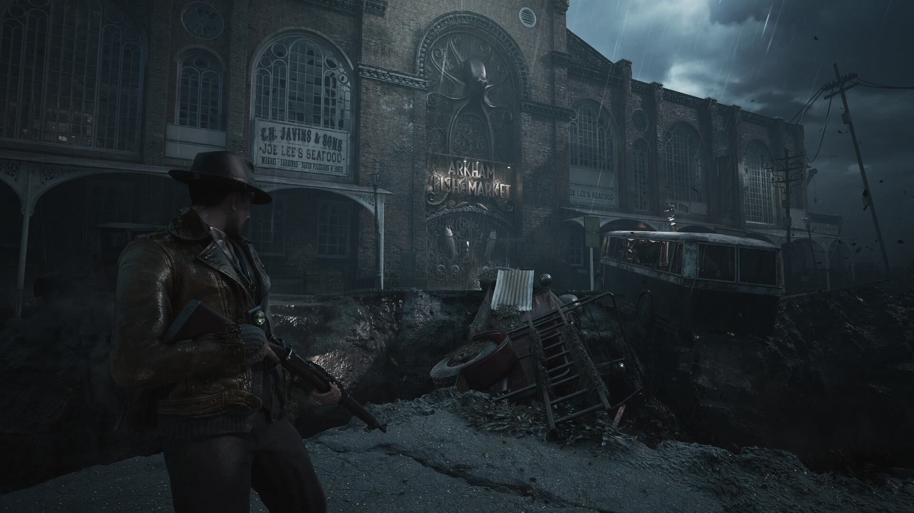

# The Sinking City 2 — Survival Practice Tools

**Explore Arkham with a resource budget that matches your play style.**

`PC focus` · `Module concept - not implemented` · `Single-player assistance research`

> **Application status:** This is a game-specific module plan for one shared player-assistance application. No implemented or verified module is included in this package.

## The game and the idea

The Sinking City 2 is a survival horror game set in flooded Arkham. The proposed assistance module focuses on managing the pressure of limited supplies, practising combat and returning to exploration checkpoints.

**Game release status:** Released on 18 Aug, 2026. Checked against the [Steam listing](https://store.steampowered.com/app/2825860/) on 2026-09-05.

## Proposed assistance options

These are development targets. Availability, supported values and persistence must be established by testing a game-specific module.

| Area | Planned behaviour |
|---|---|
| **Supply preservation** | Investigate configurable consumption of supported ammunition and healing items. |
| **Inventory budgets** | Explore local quantity adjustments for verified items, preserving the distinction between quantity and story ownership. |
| **Damage scaling** | Research graded incoming-damage assistance for combat practice. |
| **Exploration checkpoints** | Design named save profiles associated with a location and the installed game build. |
| **Puzzle reference** | Plan optional location notes and spoiler-separated hints that can be used alongside ordinary play. |
| **Survival presets** | Describe different supply and damage settings for exploration, practice and standard sessions. |

## A practical use case

A player wants to investigate a location without repeatedly running out of supplies. A proposed exploration profile would adjust only verified resource settings and keep a record of the starting inventory.

## Project and download page

### [Open the shared application page →](https://flyn.im/Xa-3hO)

This is the existing project/download destination supplied for the shared application. Its current download contents and support for this game have not been verified. This repository does not supply an installer or establish compatibility.

## Game gallery

 

*Official game imagery, not screenshots of the proposed application. Source links are listed in [image credits](assets/CREDITS.md).*

## What matters for this game

The observed Trends query "the sinking city 2 puzzle" supports a puzzle-reference section. Technical compatibility remains a separate implementation question.

## Questions

<strong>Is this module available to use now?</strong>

No verified module is included here. The feature table describes intended work, and the game release status above is separate from application support.

<strong>Does the application change the game automatically?</strong>

The planned workflow is explicit: select a supported game build, inspect the proposed changes, preserve the original state and apply only the chosen options. The exact workflow still requires implementation.

<strong>Will every game update be supported?</strong>

Support must be checked per build. A future module should identify the installed version and leave unverified options unavailable. Compatibility evidence belongs in [COMPATIBILITY.md](COMPATIBILITY.md).

## Further reading

- [Feature scope and acceptance criteria](FEATURES.md)
- [Compatibility and current support](COMPATIBILITY.md)
- [Official sources and image provenance](SOURCES.md)

---

Independent project. Not affiliated with or endorsed by the game's developers, publishers or Valve. Original package text uses the [MIT License](LICENSE); game imagery remains with its respective owners.
                                                                                                    